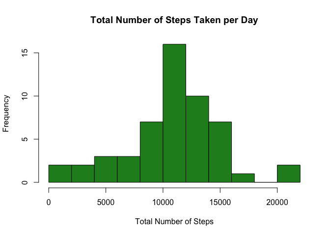
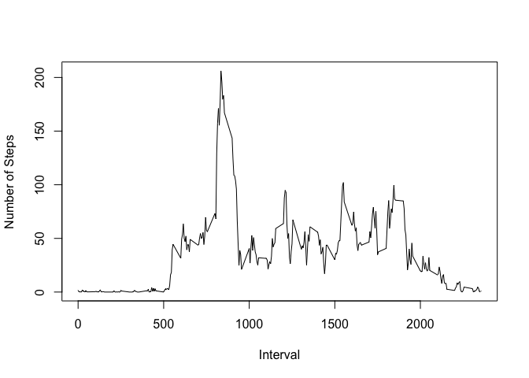
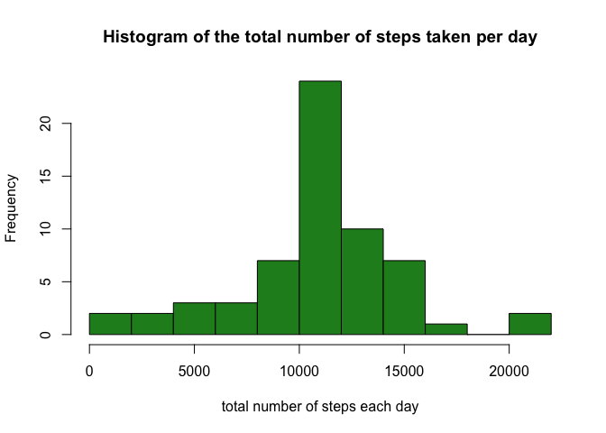
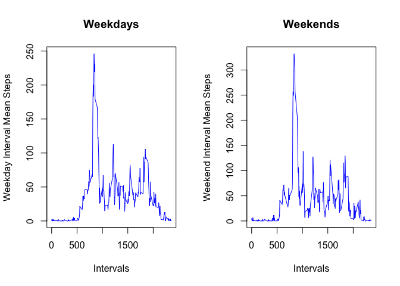

# Reproducible Research: Peer Assessment 1


##Loading and preprocessing the data


```r
setwd("~/RepData_PeerAssessment1/")
unzip("activity.zip")
activity_data <- read.csv ("activity.csv", stringsAsFactors = FALSE)
activity_data[ ,2] <- as.Date(activity_data[ ,2],format = "%Y-%m-%d")
```

##What is mean total number of steps taken per day?

A Histogram of the Total Number of Steps Taken per Day

```r
naremove_dataset <- na.omit (activity_data)
split_dataframe <- split (naremove_dataset,naremove_dataset$date)

sum_vec <- NULL
for (i in 1:53) {
      sum_vec[i] <- sum (split_dataframe[[i]][ ,1])
}
par(mfrow = c(1,1))
hist(sum_vec, 
     main = "Total Number of Steps Taken per Day", 
     xlab = "Total Number of Steps",
     col = "forest green",
     breaks = 10)
```

 

The mean Total Number of Steps Taken per Day

```r
mean (sum_vec)
```

```
## [1] 10766.19
```

The median Total Number of Steps Taken per Day

```r
median (sum_vec)
```

```
## [1] 10765
```

##What is the average daily activity pattern?


```r
interval_times <- naremove_dataset[1:288,3]
interval_means <- NULL
for (i in 1:288) {
      interval_rows <- which( interval_times[i] == naremove_dataset[ ,3])
      interval_means[i] <- mean( naremove_dataset[interval_rows,1])
}
par(mfcol = c(1,1))
plot(interval_times,interval_means,type = "l",xlab = "Interval", ylab = "Number of Steps")
```

 

The 5 Minute interval that on average contains the most steps

```r
naremove_dataset[which(interval_means==max(interval_means)),3]
```

```
## [1] 835
```

##Imputing Missing Values with the mean of the interval corresponding to the missing value

Total number of NA's in data set

```r
sum(is.na(activity_data[ ,1]))
```

```
## [1] 2304
```

Imputing values for the missing values


```r
imputna_dataset <- activity_data
for(i in 1:nrow(activity_data)) {
      if ( is.na(activity_data[i,1])==TRUE) {
            imputna_dataset[i,1] <- interval_means[which(activity_data[i,3]==interval_times)]
      }
      else {}
}
```

A histogram of the total number of steps taken per day


```r
split_nadataframe <- split (imputna_dataset,imputna_dataset$date)

sumna_vec <- NULL
for (i in 1:61) {
      sumna_vec[i] <- sum (split_nadataframe[[i]][ ,1])
}

hist(sumna_vec, 
     main = "Histogram of the total number of steps taken per day", 
     xlab = "total number of steps each day",
     col = "forest green",
     breaks = 10)
```

 

Mean total number of steps taken per day


```r
mean (sumna_vec)
```

```
## [1] 10766.19
```

Median total number of steps taken per day


```r
median (sumna_vec)
```

```
## [1] 10766.19
```

These mean and median do not differ from the original mean and median where I ignored the NA values because I replaced the NA's by the interval means.  Imputing values for the missing values did not affect our estimates of the total daily number of steps.

##Are there differences in activity patterns between weekdays and weekends?
### 

```r
Weekdays_vec<-c("Monday" , "Tuesday" , "Wednesday" , "Thursday" , "Friday")
imputna_dataset[ ,4] <- NA
colnames(imputna_dataset) <- c("steps","date","interval","day of week")
for (i in 1:nrow(imputna_dataset)) {
      if (weekdays(imputna_dataset[i,2]) %in% Weekdays_vec) {
            imputna_dataset[i,4] <- "weekday"
      }
      else { imputna_dataset[i,4] <- "weekend"}
}
imputna_dataset[ ,4] <- as.factor(imputna_dataset[ ,4])

interval_times <- imputna_dataset[1:288,3]
weekday_rows <- which(imputna_dataset[ ,4] == "weekday")
weekend_rows <- which(imputna_dataset[ ,4] == "weekend")

weekday_interval_rows <- NULL
weekend_interval_rows <- NULL
weekday_interval_means <- NULL
weekend_interval_means <- NULL
for (i in 1:288) {
      weekday_interval_rows <- which( interval_times[i] == imputna_dataset[weekday_rows,3])
      weekend_interval_rows <- which( interval_times[i] == imputna_dataset[weekend_rows,3])
      weekday_interval_means[i] <- mean( imputna_dataset[weekday_interval_rows,1])
      weekend_interval_means[i] <- mean( imputna_dataset[weekend_interval_rows,1])
}
par(mfcol = c(1,2))
plot(interval_times,weekday_interval_means, 
     main = "Weekdays",type = "l",xlab = "Intervals", ylab = "Weekday Interval Mean Steps",col = "blue")
plot(interval_times,weekend_interval_means, 
     main = "Weekends",type = "l",xlab = "Intervals", ylab = "Weekend Interval Mean Steps",col = "blue")
```

 
